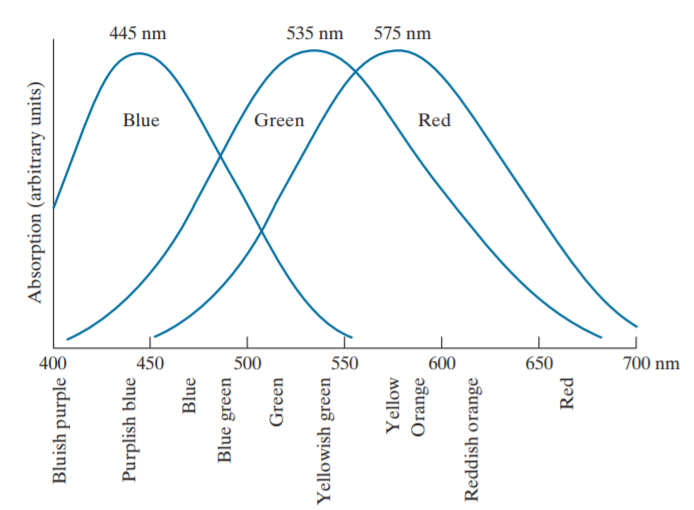
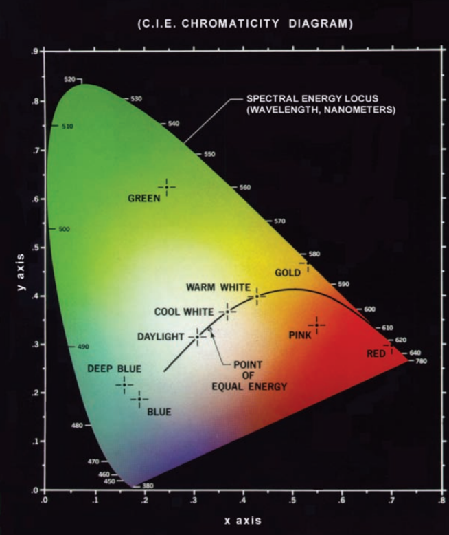

# 第六章 彩色图像处理

## 引言
### 色彩的重要性
1. 色彩可以简化提取和识别目标。
2. 人类只能辨别几十种灰度级别，但可以辨别几千种彩色。

第二点在人工图像分析中十分重要。

### 彩色图像处理的分类

1. 全彩色处理：要求图像用全彩色传感器获取。
2. 伪彩色处理：对一种特定的单色灰度或灰度范围赋予一种颜色。

## 彩色基础

### 彩色光源的质量
用于描述彩色光源质量的三个基本量：辐射、光强、亮度。

辐射：光源流出的能量总量，单位为瓦特。

光强：观察者从光源感知的能量总和，单位为流明。（如红外光线，辐射强度很大但是由于观察者很难感知到，其光强几乎为0。）

亮度：不可度量，体现了无色的强度概念（即若该光源缺乏颜色，仅讨论其亮度或数值，黑白程度。）

### 原色

CIE规定三个特定波长的值为三原色，然而实际上并没有一个单一的颜色可以称为红色、绿色或蓝色，三个固定的RGB分量单独作用（不同的强度比混合）产生不了光谱上的所有颜色。（原因参考CIE色度图）

每一个原色实际上有一个波长范围，不同的波长的三原色混合才能得到光谱上的各种其它颜色，如下图：

### 不同颜色的特性
通常用于区别不同颜色特性的是亮度、色调和饱和度。其中色调和饱和度一起称为色度。

亮度：如前文所诉，指无色的强度概念

色调：光波混合中与主波长有关的属性，表示观察者感知的主要颜色，例如描述红色、橙色或者黄色时是指其色调。

饱和度：指一种颜色混合白光的数量。例如红加白为粉红色。

### CIE色度图

1. $X$轴色度坐标相当于红基色的比例，$Y$轴色度坐标相当于绿基色的比例。相应的z（蓝）可以由公式 $z = 1 - (x + y)$得到。
2. 该图像边界对应的是光谱中的纯色（从380nm的紫色到780nm的红色）。
3. 该图中间存在一个等能量点（白色）表示三种能量所占的百分比相同的点
4. 
